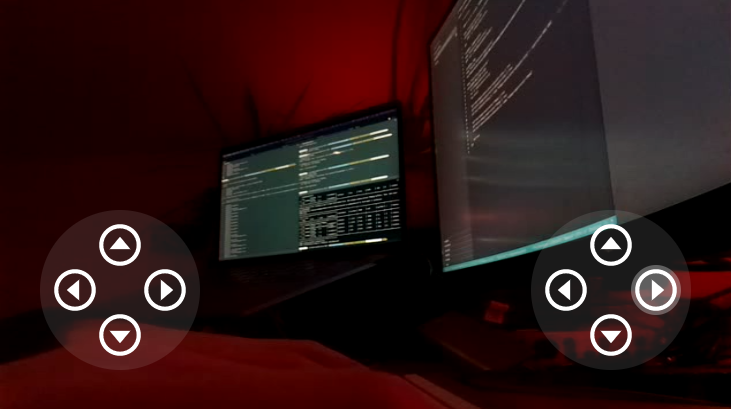

# Freenove 4-Wheels Webapp

This is a test project to build a web application to control the Freenove 4-Wheels
robot.



# Dependencies

Some dependencies need to be installed to use the project in your Raspberry Pi. I may
have missed some dependencies, so please bear in mind this might not be an exclusive list.

```sh
# NodeJS 14
curl -sL https://deb.nodesource.com/setup_14.x | sudo -E bash -
sudo apt-get install -y nodejs

# PM2 process manager to start servers when RPi reboots or the processes crash
npm install pm2@latest -g
# Generate the startup script
pm2 startup
# Run the command output by the previous command

# ffmpeg
sudo apt-get install ffmpeg

# Video4Linux2 kernel mod
sudo modprobe bcm2835-v4l2
```

# Deploy the project

To deploy all your code to the RPi you will connect to the RPi via SSH from your machine. It will copy
the code and setup the project.

```sh
# Deploy server, client and camera-server
scripts/deploy.sh
```

NOTE: The

## server

Python server controlling the robot. Exposes Flask HTTP API.

```sh
# Deploy server
scripts/deploy_server.sh
```

## client

NextJS application with the interface to control the robot. The application is build in your local
machine and the built code sent to the robot.

```sh
# Deploy client
scripts/deploy_client.sh
```

## camera-server

Runs two processes:

- NodeJS websocket relay
- `ffmpeg` encoding the output of the v4l2 /dev/video0 to a MPEGTS, which is broadcasted by the websocket relay.

```sh
# Deploy camera-server
scripts/deploy_camera_server.sh
```
